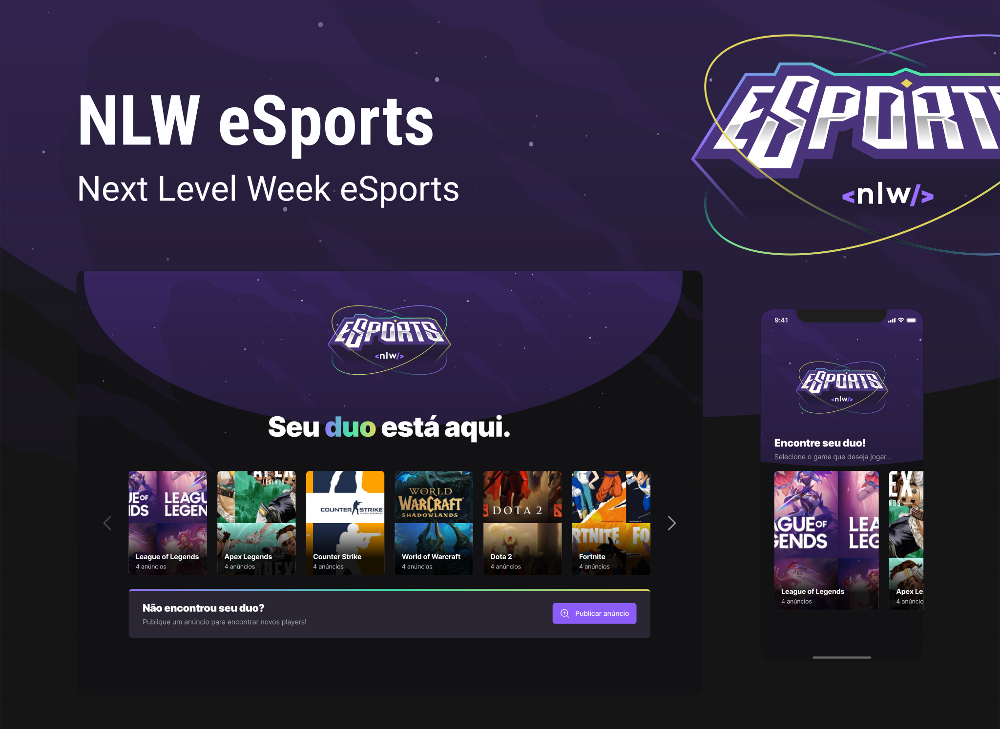

<h1 align="center">
    
</h1>

<p align="center">
  <a href="#-projeto">Projeto</a>&nbsp;&nbsp;&nbsp;|&nbsp;&nbsp;&nbsp;
  <a href="#-tecnologias">Tecnologias</a>&nbsp;&nbsp;&nbsp;|&nbsp;&nbsp;&nbsp;
  <a href="#-layout">Layout</a>&nbsp;&nbsp;&nbsp;|&nbsp;&nbsp;&nbsp;
  <a href="#-como-contribuir">Como contribuir</a>&nbsp;&nbsp;&nbsp;|&nbsp;&nbsp;&nbsp;
  <a href="#memo-licença">Licença</a>
</p>

<p align="center">
 <a aria-label="Completed" href="https://nextlevelweek.com/aulas/booster/1/edicao/1">
   </img>
 </a>
 
  
</p>

<br>


## 💻 Projeto

O eSports é um projeto que visa conectar jogadores que estão em busca de uma parceria para a sua jogatina.

<h1 align="center">
  
</h1>

## 🚀 Tecnologias

Esse projeto foi desenvolvido com as seguintes tecnologias:

- [Node.js](https://nodejs.org/en/)
- [Prisma](https://www.prisma.io/)
- [TypeScript](https://www.typescriptlang.org/)
- [React](https://reactjs.org)
- [React Native](https://facebook.github.io/react-native/)
- [Expo](https://expo.io/)


## 🔖 Layout

Para vizualisar o layout do projeto utilize a plataforma [Figma](https://www.figma.com/file/x8zI1YSYpRDd7dMKbjhahf/NLW-eSports-(Community)?node-id=0%3A1) 


## ⚙️ Como executar

Instale o [Git](https://git-scm.com/), [Node.js](https://nodejs.org/en/) e o [Yarn](https://yarnpkg.com/). Logo após, digite os
seguintes comandos no seu terminal.

### Instalando o Back-end 

```bash
# Faça o clone deste repositório
$ git clone https://github.com/Luis-carlos-dev/nlw-esports.git

# Entre no repositório
$ cd nlw-esports/server

# Instale as dependências com yarn ou npm 
$ yarn install
$ ou
$ npm install

# Execute o projeto
$ yarn dev
$ ou
$ npm run dev

# Execute na porta 3333
```

### Instalando o Front-end 

```bash
# Faça o clone deste repositório
$ git clone https://github.com/Luis-carlos-dev/nlw-esports.git

# Entre no repositório
$ cd nlw-esports/web

# Instale as dependências com yarn ou npm 
$ yarn install
$ ou
$ npm install

# Execute o projeto
$ yarn dev
$ ou
$ npm run dev

# Execute na porta 3000
```

### Instalando o Mobile

```bash
# Faça o clone deste repositório
$ git clone https://github.com/Luis-carlos-dev/nlw-esports.git

# Entre no repositório
$ cd nlw-esports/mobile

# Instale as dependências com yarn ou npm 
$ yarn install
$ ou
$ npm install

# Execute o projeto
$ npx expo start

$ O Expo será aberto, basta escanear o qrcode no terminal.
$ Para executar o projeto mobile em seu smartphone baixe o Expo Go, disponível na GooglePlay e AppStore.
```

## :memo: Licença

Esse projeto está sob a licença MIT. Veja o arquivo [LICENSE](LICENSE.md) para mais detalhes.

---

Feito com ♥ por Luis Carlos durante a NLW da Rocketseat
